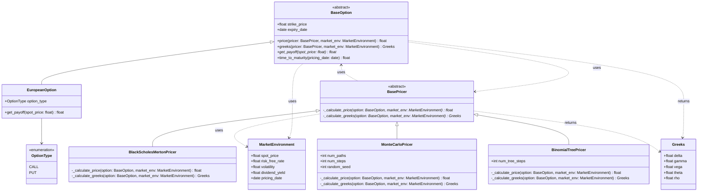

# Option Pricing Library

This library will be a professional Python implementation of various option pricing models for different types of options. 
It is written using **Object-Oriented Programming (OOP)**. It is my personal project on which I am working because I am interested in option pricing methods and I want to get better in object-oriented programming in Python.

## Key Features
- **Contract-Based Design**: Instruments store only contract logic (payoffs).
- **Model Independence**: Swap between Black-Scholes, Monte Carlo, and Binomial Trees at runtime.
- **Risk Management**: Dedicated `Greeks` container for managing first and second-order sensitivities.

## Architecture

