# Option Pricing Library

A Python library for pricing European, American, and Asian options and computing Greeks using Black-Scholes-Merton (BSM), Binomial Trees (CRR model), and Monte Carlo simulation. Built from scratch with clean OOP architecture — no AI-generated code.

## Supported Instruments
- **European options** — priced via BSM (closed-form), Binomial Tree, and Monte Carlo
- **American options** — priced via Binomial Tree with early exercise optimization
- **Asian options** — fixed-strike and floating-strike arithmetic average, priced via Monte Carlo with full path simulation

## Features
- **Separation of instruments and engines** — options define contract logic (payoffs), pricers implement the math. Swap pricing models at runtime without changing instrument code.
- **Risk management (Greeks)** — closed-form delta, gamma, vega, theta, and rho from BSM with correct limiting behavior at expiry and zero volatility. Numerical Greeks via finite differences for Binomial Tree and Monte Carlo pricers.
- **Robust edge case handling** — maturity limits, zero-volatility pricing, numerical overflow detection, input validation with clear error messages.
- **Comprehensive test suite** — 50+ tests using `pytest`: known reference values from Hull and online calculators, convergence tests (Binomial Tree and Monte Carlo vs BSM), put-call parity, American vs European price bounds, Asian vs European price bounds, Greek sanity checks, input validation, and Monte Carlo reproducibility.
- **Extensible architecture** — adding new option types (e.g. barrier options) requires only new subclasses, no changes to existing code. UML class diagrams designed before implementation.

## Quick Example
```python
from datetime import date
from core.enums import OptionType
from instruments.european import EuropeanOption
from market.environment import MarketEnvironment
from engines.black_scholes_merton import BlackScholesMertonPricer

option = EuropeanOption(strike_price=100, expiry_date=date(2027, 3, 18), option_type=OptionType.CALL)
market = MarketEnvironment(spot_price=100, risk_free_rate=0.05, volatility=0.25, pricing_date=date(2026, 3, 18))

price = option.price(pricer=BlackScholesMertonPricer(), market_env=market)
greeks = option.greeks(pricer=BlackScholesMertonPricer(), market_env=market)
```

<!-- ## Research Notebooks
See the `notebooks/` folder for interactive examples demonstrating the library in practice, including convergence analysis, payoff diagrams, Greek surfaces, and comparisons across pricing engines. -->

## Architecture
Designed using UML class diagrams before writing any code. See below for the full diagram.

```mermaid
classDiagram
    class BaseOption {
        <<abstract>>
        +date expiry_date
        +price(pricer: BasePricer, market_env: MarketEnvironment) float
        +greeks(pricer: BasePricer, market_env: MarketEnvironment) Greeks
        +get_payoff(*args, **kwargs)* float|np.ndarray
        +time_to_maturity(pricing_date: date) float

    }

class OptionType {
    <<enumeration>>
    CALL 
    PUT
}  



class EuropeanOption {
    +OptionType option_type
    +float strike_price
    +get_payoff(spot_price: float|np.ndarray) float|np.ndarray
}

BaseOption <|-- EuropeanOption
EuropeanOption --> OptionType

class AmericanOption {
    +OptionType option_type
    +float strike_price
    +get_payoff(spot_price: float|np.ndarray) float|np.ndarray
}

BaseOption <|-- AmericanOption
AmericanOption --> OptionType

class AsianOption {
    +OptionType option_type
    +AsianType asian_type
    +float|None strike_price
    +get_payoff(price_paths: np.ndarray) np.ndarray
}

class AsianType {
    <<enumeration>>
    FIXED_STRIKE 
    FLOATING_STRIKE
} 

BaseOption <|-- AsianOption
AsianOption --> OptionType
AsianOption --> AsianType

class MarketEnvironment {
    +float spot_price
    +float risk_free_rate
    +float volatility
    +float dividend_yield
    +date pricing_date
}

class Greeks {
    +float delta
    +float gamma
    +float vega
    +float theta
    +float rho
}

class BasePricer {
    <<abstract>>
    -_calculate_price(option: BaseOption, market_env: MarketEnvironment)* float
    -_calculate_greeks(option: BaseOption, market_env: MarketEnvironment) Greeks
}

class BlackScholesMertonPricer {
    -_calculate_price(option: BaseOption, market_env: MarketEnvironment) float
    -_calculate_greeks(option: BaseOption, market_env: MarketEnvironment) Greeks    
}

BasePricer <|-- BlackScholesMertonPricer

class MonteCarloPricer {
    +int num_paths
    +int num_steps
    +int|None random_seed
    -_calculate_price(option: BaseOption, market_env: MarketEnvironment) float
}

BasePricer <|-- MonteCarloPricer

class BinomialTreePricer {
    +int num_tree_steps
    -_calculate_price(option: BaseOption, market_env: MarketEnvironment) float
}

BasePricer <|-- BinomialTreePricer

BaseOption ..> BasePricer : uses
BaseOption ..> MarketEnvironment : uses 
BaseOption ..> Greeks : returns 

BasePricer ..> BaseOption : uses 
BasePricer ..> MarketEnvironment : uses 
BasePricer ..> Greeks : returns
```


