# Option Pricing Library

A Python library for pricing European, American, and Asian options and computing Greeks using Black-Scholes-Merton (BSM), Binomial Trees (CRR model), and Monte Carlo simulation. Built from scratch with clean OOP architecture — no AI-generated code (except for plotting in the research notebooks).

## Supported Instruments
- **European options** — priced via BSM (closed-form), Binomial Tree, and Monte Carlo
- **American options** — priced via Binomial Tree with early exercise optimization
- **Asian options** — fixed-strike and floating-strike arithmetic average, priced via Monte Carlo with full path simulation

## Features
- **Separation of instruments and engines** — options define contract logic (payoffs), pricers implement the math. Swap pricing models at runtime without changing instrument code.
- **Risk management (Greeks)** — closed-form delta, gamma, vega, theta, and rho from BSM with correct limiting behavior at expiry and zero volatility. Numerical Greeks via finite differences for Binomial Tree and Monte Carlo pricers.
- **Robust edge case handling** — maturity limits, zero-volatility pricing, numerical overflow detection, input validation with clear error messages.
- **High-Performance Vectorization:** The `BlackScholesMertonPricer` natively supports NumPy arrays across all `MarketEnvironment` variables (Spot, Volatility, Rates, Dividends). This allows for the rapid computation of pricing surfaces and risk profiles across tens of thousands of scenarios by entirely avoiding slow Python `for` loops.
- **Comprehensive test suite** — 60+ tests using `pytest`: known reference values from Hull and online calculators, convergence tests (Binomial Tree and Monte Carlo vs BSM), put-call parity, American vs European price bounds, Asian vs European price bounds, Greek sanity checks, input validation, and Monte Carlo reproducibility.
- **Extensible architecture** — adding new option types (e.g. barrier options) requires only new subclasses, no changes to existing code. UML class diagrams designed before implementation.


<!-- ## Research Notebooks
See the `notebooks/` folder for interactive examples demonstrating the library in practice, including convergence analysis, payoff diagrams, Greek surfaces, and comparisons across pricing engines. -->

## Research Notebooks
See the `notebooks/` folder for interactive examples demonstrating the library in practice, including convergence analysis, Greek analysis, and comparisons across pricing engines.

## Architecture
Designed using UML class diagrams before writing any code. See below for the full diagram.

```mermaid
classDiagram
    class BaseOption {
        <<abstract>>
        +date expiry_date
        +price(pricer: BasePricer, market_env: MarketEnvironment) float
        +greeks(pricer: BasePricer, market_env: MarketEnvironment) Greeks
        +get_payoff(*args, **kwargs)* float|np.ndarray
        +time_to_maturity(pricing_date: date) float

    }

class OptionType {
    <<enumeration>>
    CALL 
    PUT
}  

class EuropeanOption {
    +OptionType option_type
    +float strike_price
    +get_payoff(spot_price: float|np.ndarray) float|np.ndarray
}

BaseOption <|-- EuropeanOption
EuropeanOption --> OptionType

class AmericanOption {
    +OptionType option_type
    +float strike_price
    +get_payoff(spot_price: float|np.ndarray) float|np.ndarray
}

BaseOption <|-- AmericanOption
AmericanOption --> OptionType

class AsianOption {
    +OptionType option_type
    +AsianType asian_type
    +float|None strike_price
    +get_payoff(price_paths: np.ndarray) np.ndarray
}

class AsianType {
    <<enumeration>>
    FIXED_STRIKE 
    FLOATING_STRIKE
} 

BaseOption <|-- AsianOption
AsianOption --> OptionType
AsianOption --> AsianType

class MarketEnvironment {
    +float|np.ndarray spot_price
    +float|np.ndarray risk_free_rate
    +float|np.ndarray volatility
    +float|np.ndarray dividend_yield
    +date pricing_date
}

class Greeks {
    +float|np.ndarray delta
    +float|np.ndarray gamma
    +float|np.ndarray vega
    +float|np.ndarray theta
    +float|np.ndarray rho
}

class BasePricer {
    <<abstract>>
    -_calculate_price(option: BaseOption, market_env: MarketEnvironment)* float
    -_calculate_greeks(option: BaseOption, market_env: MarketEnvironment) Greeks
}

class BlackScholesMertonPricer {
    -_calculate_price(option: BaseOption, market_env: MarketEnvironment) float|np.ndarray
    -_calculate_greeks(option: BaseOption, market_env: MarketEnvironment) Greeks    
}

BasePricer <|-- BlackScholesMertonPricer

class MonteCarloPricer {
    +int num_paths
    +int num_steps
    +int|None random_seed
    -_calculate_price(option: BaseOption, market_env: MarketEnvironment) float
}

BasePricer <|-- MonteCarloPricer

class BinomialTreePricer {
    +int num_tree_steps
    -_calculate_price(option: BaseOption, market_env: MarketEnvironment) float
}

BasePricer <|-- BinomialTreePricer

BaseOption ..> BasePricer : uses
BaseOption ..> MarketEnvironment : uses 
BaseOption ..> Greeks : returns 

BasePricer ..> BaseOption : uses 
BasePricer ..> MarketEnvironment : uses 
BasePricer ..> Greeks : returns
```




## Quick Start: Vectorized Greeks Calculation

The library is designed for rapid quantitative research. By passing NumPy arrays into the `MarketEnvironment`, the BSM engine automatically vectorizes the calculations, correctly handling edge cases like zero-volatility and expiration limits.

```python
import numpy as np
from datetime import date, timedelta
from core.enums import OptionType
from instruments.european import EuropeanOption
from market.environment import MarketEnvironment
from engines.black_scholes_merton import BlackScholesMertonPricer

# 1. Define the Option Contract
expiry = date.today() + timedelta(days=90)
call_option = EuropeanOption(strike_price=100.0, expiry_date=expiry, option_type=OptionType.CALL)

# 2. Define a Vectorized Market Environment (Array of Spot Prices)
spot_prices = np.linspace(80, 120, 500) # 500 different spot scenarios
market = MarketEnvironment(
    spot_price=spot_prices,
    risk_free_rate=0.05,
    volatility=0.20,
    dividend_yield=0.02,
    pricing_date=date.today()
)

# 3. Calculate 500 prices and Greeks instantly (No loops!)
bsm_engine = BlackScholesMertonPricer()
prices = call_option.price(pricer=bsm_engine, market_env=market)
greeks = call_option.greeks(pricer=bsm_engine, market_env=market)

# prices is now a NumPy array of 500 option values and greeks.delta is now a NumPy array of 500 Delta values
```
